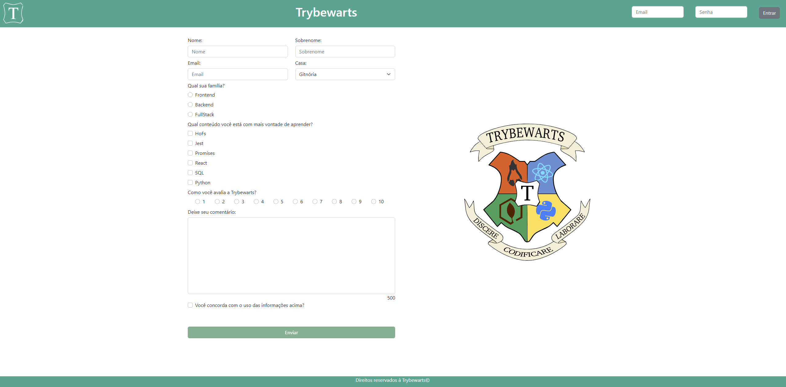
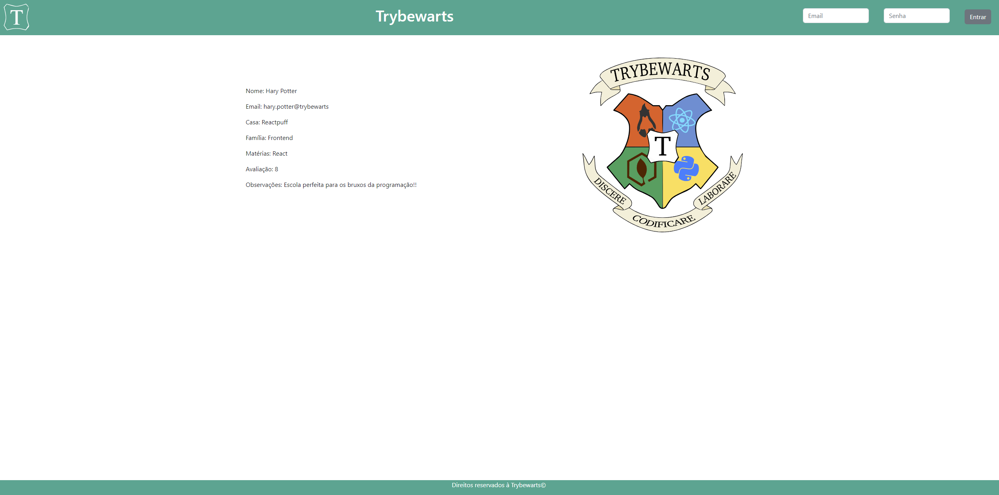

# Projeto Trybewarts (Quarto projeto desenvolvido)

Este projeto marcou um importante marco no curso, pois foi a nossa primeira incursão em um trabalho em equipe, com a tarefa desafiadora de criar uma página de formulário para a prestigiosa Escola de Magia de Trybewarts. Nossa missão era desenvolver um espaço onde os aspirantes a bruxos e bruxas pudessem expressar seus pensamentos e fornecer feedback valioso sobre a experiência na escola.

Inspirado na icônica obra "Harry Potter" de J.K. Rowling, o projeto nos imergiu no mundo da fantasia, onde a magia e a tecnologia se entrelaçam. Exploramos não apenas o desenvolvimento web, mas também a capacidade de trazer à vida um ambiente virtual que captura a essência da narrativa da autora e proporciona aos usuários uma experiência mágica e envolvente.

## Habilidades desenvolvidas

Durante a execução deste projeto, foram amplamente aprimoradas as seguintes habilidades:

- Resolução de problemas;
- Estilização de página via CSS;
- Criação de formulários;
- Comunicação;
- Trabalho em equipe.

## O que foi desenvolvido

Todo o conteúdo e elementos presentes na pasta "images", bem como os arquivos "index.html", "style.css" e "script.js" foram desenvolvidos em conjunto com meu colega _[Licínio Pereira](https://github.com/liciniopsj)_, escolhemos o pair programming como método de desenvolvimento. É importante mencionar que os demais arquivos foram elaborados pela equipe da Trybe como parte do contexto mais amplo do projeto.

## Requisitos do projeto

1. Criar uma barra verde na parte superior da página;
2. Adicionar o logotipo da Trybewarts;
3. Acrescentar um formulário de login no header;
4. Criar um título com o texto "Trybewarts" centralizado dentro do Header;
5. Adicionar um formulário no corpo da página;
6. Fazer com que a direção do formulário seja vertical;
7. Adicionar a logo da Trybewarts ao lado direito da página;
8. Acrescentar inputs de nome, sobrenome e email ao formulário;
9. Acrescentar um select ao formulário;
10. Posicionar os campos de Nome e Sobrenome lado a lado;
11. Posicionar os campos de Email e Casa lado a lado;
12. Adicionar 3 inputs do tipo radio ao formulário;
13. Criar inputs do tipo checkbox;
14. Criar um campo de avaliação;
15. Criar um textarea;
16. Criar uma checkbox que servirá para validar as informações digitadas pela pessoa usuária;
17. Criar um botão de "Enviar" para submeter o formulário;
18. Habilitar o botão "Enviar" após a validação do checkbox;
19. Criar um rodapé ao final da página;
20. Criar um contador de caracteres;
21. Substituir o formulário pelas informações da pessoa estudante.

## Demonstração de como ficou o projeto depois de pronto

